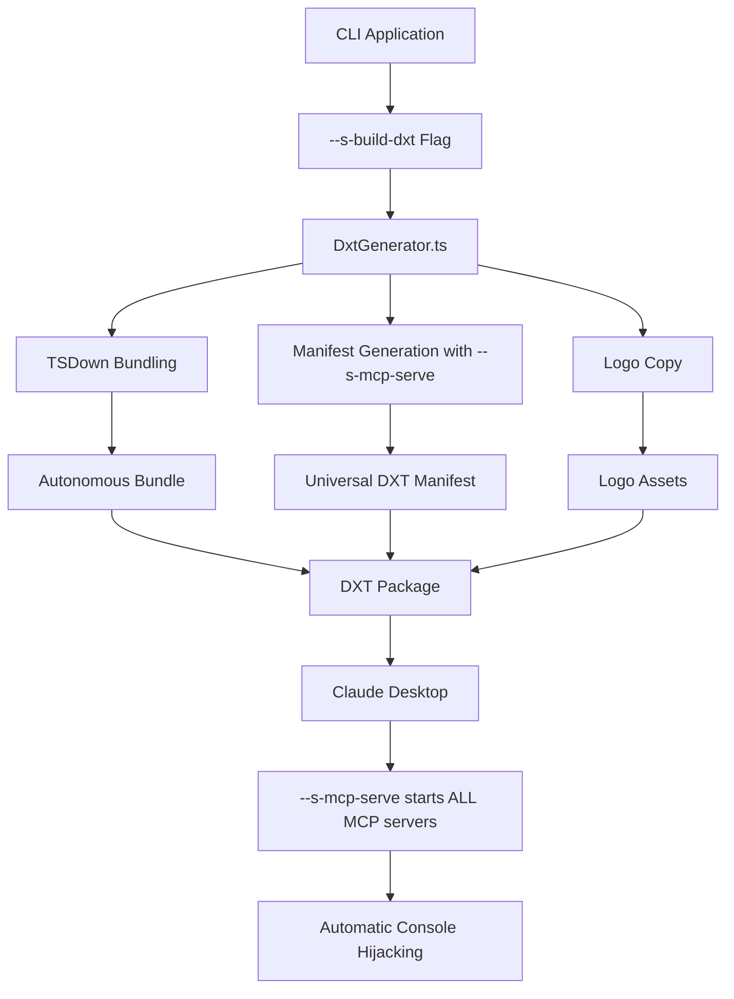

# DXT Implementation Guide

## Overview

This document explains the complete implementation of DXT (Desktop Extension Tool) package generation in `@alcyone-labs/arg-parser`. The system automatically converts CLI applications built with ArgParser into autonomous, distributable DXT packages that can be installed in Claude Desktop as MCP (Model Context Protocol) servers.

## ✨ v1.4.0 Major Updates

### Universal `--s-mcp-serve` Compatibility

**Problem Solved**: DXT packages previously used hardcoded "serve" subcommands, which didn't work universally across different ArgParser CLIs.

**Solution**: All generated DXT packages now use the `--s-mcp-serve` system flag for maximum compatibility.

**Technical Changes**:
- **`src/DxtGenerator.ts`**: Updated `generateCliArgsForDxt()` to return `["--s-mcp-serve"]`
- **Manifest generation**: Now generates `"args": ["${__dirname}/script.js", "--s-mcp-serve"]`
- **Universal compatibility**: Works across all ArgParser CLIs regardless of MCP subcommand names

### Automatic Console Hijacking

**Problem Solved**: MCP tools were failing with "console.log is not a function" errors due to improper console replacement.

**Solution**: Fixed console hijacking implementation using `@alcyone-labs/simple-mcp-logger`.

**Technical Changes**:
- **`src/ArgParser.ts`**: Fixed console hijacking in MCP handler: `(globalThis as any).console = logger`
- **`src/ArgParserBase.ts`**: Applied same fix to `--s-mcp-serve` handler
- **Zero boilerplate**: Developers can now write normal console code without MCP mode detection

### Centralized MCP Serving

**New Feature**: `--s-mcp-serve` system flag starts ALL MCP servers defined in a CLI with one command.

**Technical Implementation**:
- **Detection**: Added in `#_handleGlobalChecks()` in `ArgParserBase.ts`
- **Handler**: `#_handleMcpServeFlag()` method with comprehensive error handling
- **Discovery**: `#_findAllMcpSubCommands()` traverses parser tree to find all MCP servers
- **Transport parsing**: `#_parseMcpTransportOptions()` handles CLI transport configuration

## Architecture Overview



## Core Components

### 1. DXT Generation Entry Point

**File**: `src/DxtGenerator.ts`
**Trigger**: `--s-build-dxt` system flag

```typescript
// Usage: No parameters needed - uses calling script automatically
node my-cli.js --s-build-dxt
```

The system automatically detects:
- **Entry Point**: `process.argv[1]` (the calling script)
- **Working Directory**: `process.cwd()`
- **Package Info**: From `package.json`
- **Flag Definitions**: From ArgParser instance

### 2. TSDown Integration

**Purpose**: Creates autonomous, self-contained JavaScript bundles

```typescript
const buildConfig = {
  entry: [entryFileName],           // e.g., "canny-cli.js"
  outDir: "dxt",                   // Output directory
  format: ["esm"],                 // ES modules only
  target: "node22",                // Node.js 22 compatibility
  noExternal: () => true,          // Bundle everything
  minify: false,                   // Keep readable for debugging
  sourcemap: false,                // No source maps needed
  clean: false,                    // Don't clean existing files
  silent: process.env['NO_SILENCE'] !== '1',  // Silent by default
  external: [                      // Node.js built-ins only
    "stream", "fs", "path", "url", "util", "events", 
    "child_process", "os", "tty", "process", "crypto", 
    "http", "https", "net", "zlib"
  ],
  platform: "node",
  plugins: []
};
```

**Key Features**:
- **Autonomous Bundling**: All dependencies included (no `node_modules` needed)
- **ES Module Output**: Modern JavaScript format
- **Node.js Built-ins**: Only system modules are external
- **Debug Support**: Use `DEBUG=1` to see full configuration

### 3. Manifest Generation

**Purpose**: Creates DXT-compliant manifest with MCP configuration

The manifest is automatically generated from:
- **Package.json**: Name, version, description, author, repository
- **ArgParser Flags**: Tool schema with types, enums, defaults, required fields
- **Environment Variables**: From flag `env` properties
- **App Command Name**: Used as DXT ID

```json
{
  "dxt_version": "0.1",
  "id": "canny-search",                    // From appCommandName
  "name": "canny-cli",                     // From package.json
  "version": "1.0.0",                      // From package.json
  "description": "...",                    // From package.json
  "author": {                              // From package.json
    "name": "Author Name",
    "url": "https://github.com/..."
  },
  "server": {
    "type": "node",
    "entry_point": "canny-cli.js",         // Bundled entry point
    "mcp_config": {
      "command": "node",
      "args": ["${__dirname}/canny-cli.js", "serve"],
      "env": {
        "CANNY_API_KEY": "${user_config.CANNY_API_KEY}"
      }
    }
  },
  "tools": [...],                          // Generated from flags
  "user_config": {...},                    // Environment variables
  "icon": "logo.jpg",
  "repository": {...},
  "license": "MIT"
}
```

### 4. Tool Schema Generation

**Source**: ArgParser flag definitions
**Output**: JSON Schema for MCP tools

```typescript
// Flag definition in CLI
{
  name: "query",
  type: "string",
  description: "Search query for feature requests",
  mandatory: true
}

// Generated tool schema
{
  "name": "canny-search",
  "description": "Search Canny for relevant feature requests",
  "input_schema": {
    "type": "object",
    "properties": {
      "query": {
        "type": "string",
        "description": "Search query for feature requests"
      }
    },
    "required": ["query"]
  }
}
```

**Type Mapping**:
- `String` → `"string"`
- `Number` → `"number"`
- `Boolean` → `"boolean"`
- `Array` → `"array"`
- `enum` → JSON Schema enum
- `defaultValue` → JSON Schema default
- `mandatory` → Required array

### 5. Environment Variable Handling

**Critical Feature**: Maintains naming convention compatibility

```typescript
// Original flag definition
{
  name: "apiKey",
  env: "CANNY_API_KEY",
  description: "Canny API key"
}

// Generated manifest (CORRECT - maintains original env var name)
{
  "server": {
    "mcp_config": {
      "env": {
        "CANNY_API_KEY": "${user_config.CANNY_API_KEY}"
      }
    }
  },
  "user_config": {
    "CANNY_API_KEY": {
      "type": "string",
      "title": "CANNY API KEY",
      "description": "Canny API key",
      "required": false,
      "sensitive": true
    }
  }
}
```

**Why This Matters**:
- Code expects: `process.env.CANNY_API_KEY`
- User configures: `CANNY_API_KEY` in Claude Desktop
- Runtime flow: `user_config.CANNY_API_KEY` → `env.CANNY_API_KEY` → `process.env.CANNY_API_KEY`

### 6. Logo Integration

**Challenge**: TSDown's `copy` option doesn't work in programmatic mode
**Solution**: Manual copy after build

```typescript
private async copyLogoManually(): Promise<void> {
  const possibleLogoPaths = [
    // From built library assets
    path.join(path.dirname(new URL(import.meta.url).pathname), '..', 'assets', 'logo_1_small.jpg'),
    // From node_modules
    path.join(process.cwd(), 'node_modules', '@alcyone-labs', 'arg-parser', 'dist', 'assets', 'logo_1_small.jpg'),
    // From package root dist/assets (for local build)
    path.join(process.cwd(), 'dist', 'assets', 'logo_1_small.jpg'),
    // From library root (development)
    path.join(process.cwd(), '..', '..', '..', 'docs', 'MCP', 'icons', 'logo_1_small.jpg'),
  ];
  
  // Try each path until one works
  for (const logoPath of possibleLogoPaths) {
    if (fs.existsSync(logoPath)) {
      fs.copyFileSync(logoPath, path.join('dxt', 'logo.jpg'));
      return;
    }
  }
}
```

## MCP Server Integration

### 1. MCP Subcommand Structure

DXT packages work with ArgParser's MCP subcommand system:

```typescript
// CLI defines MCP subcommand
parser.addMcpSubCommand({
  name: "serve",
  description: "Start MCP server",
  logo: "path/to/logo.jpg"  // Optional custom logo
});
```

### 2. Runtime Flow

1. **DXT Installation**: User installs `.dxt` file in Claude Desktop
2. **MCP Server Start**: Claude Desktop runs `node canny-cli.js serve`
3. **MCP Protocol**: Server communicates via JSON-RPC 2.0
4. **Tool Execution**: Claude calls tools with parameters from manifest schema

### 3. Environment Variable Flow

```
Claude Desktop User Config
         ↓
    user_config.CANNY_API_KEY
         ↓
    server.mcp_config.env.CANNY_API_KEY
         ↓
    process.env.CANNY_API_KEY
         ↓
    CLI Application Code
```

## Debug Features

### 1. Debug Mode

```bash
DEBUG=1 node my-cli.js --s-build-dxt
```

**Output**:
- Full TSDown configuration
- Logo search paths and results
- Generated manifest preview
- Config file: `dxt/tsdown.config.dxt.ts`

### 2. Manual Testing

```bash
# Test TSDown configuration manually
cd dxt
npx tsdown -c tsdown.config.dxt.ts

# Test MCP server manually
node canny-cli.js serve
```

### 3. Silent Mode Control

```bash
# Default: Silent mode (clean output)
node my-cli.js --s-build-dxt

# Debug mode: Full TSDown warnings
NO_SILENCE=1 node my-cli.js --s-build-dxt
```

## Build Process Flow

1. **Entry Point Detection**: Uses `process.argv[1]`
2. **TSDown Configuration**: Creates autonomous bundle config
3. **Debug Output**: If `DEBUG=1`, shows config and creates debug file
4. **TSDown Build**: Bundles all dependencies into `dxt/` directory
5. **Logo Copy**: Manual copy since TSDown programmatic API limitation
6. **Manifest Generation**: Creates DXT manifest from package.json and flags
7. **DXT Packaging**: Ready for `npx @anthropic-ai/dxt pack dxt/`

## File Structure

```
project/
├── my-cli.js                    # Original CLI
├── package.json                 # Project metadata
└── dxt/                        # Generated DXT package
    ├── my-cli.js               # Bundled entry point (1MB+)
    ├── chunk-*.js              # Additional bundle chunks
    ├── manifest.json           # DXT manifest
    ├── logo.jpg               # Logo (37KB)
    └── tsdown.config.dxt.ts   # Debug config (if DEBUG=1)
```

## Final DXT Package

```
my-cli-1.0.0.dxt               # Final package (2.8MB compressed, 13.4MB unpacked)
├── Bundled JavaScript files   # Autonomous, no dependencies
├── manifest.json              # Complete MCP configuration
└── logo.jpg                   # Visual identifier
```

## Key Design Decisions

1. **No Parameters**: `--s-build-dxt` uses calling script automatically
2. **Autonomous Bundles**: Everything included, no external dependencies
3. **Environment Variable Preservation**: Maintains original naming for compatibility
4. **Manual Logo Copy**: Workaround for TSDown programmatic API limitation
5. **Debug Support**: Full debugging capabilities with environment flags
6. **Silent by Default**: Clean output unless debugging

## Usage Examples

### Basic Usage
```bash
node my-cli.js --s-build-dxt
npx @anthropic-ai/dxt pack dxt/
```

### Debug Mode
```bash
DEBUG=1 node my-cli.js --s-build-dxt
```

### Manual Testing
```bash
cd dxt
npx tsdown -c tsdown.config.dxt.ts
node my-cli.js serve
```

## Troubleshooting

### Common Issues

**1. Logo Not Found**
```bash
⚠ Logo not found in any expected location
```
**Solution**: Ensure logo exists in one of the search paths or add custom logo via MCP subcommand

**2. TSDown Warnings**
```bash
[UNRESOLVED_IMPORT] Warning: Could not resolve '...'
```
**Solution**: These are normal TSDown warnings, use `NO_SILENCE=1` to see them or ignore

**3. Environment Variables Not Working**
```bash
process.env.MY_VAR is undefined
```
**Solution**: Check that flag has `env: "MY_VAR"` property and manifest uses original env var name

**4. DXT Package Too Large**
```bash
package size: 10MB+
```
**Solution**: Review dependencies, consider excluding large unused modules

### Performance Considerations

- **Bundle Size**: Typical packages are 2-3MB compressed, 10-15MB unpacked
- **Build Time**: Usually 30-60 seconds depending on dependency complexity
- **Runtime**: Autonomous bundles start quickly (no dependency resolution)

## Security Considerations

1. **Environment Variables**: Marked as `sensitive: true` in user config
2. **Autonomous Bundles**: No external network dependencies at runtime
3. **Code Isolation**: Each DXT package runs in its own process
4. **Input Validation**: MCP protocol provides schema validation

## v1.4.0 Technical Implementation Details

### 1. Universal `--s-mcp-serve` Implementation

**File**: `src/DxtGenerator.ts`

```typescript
// OLD: Hardcoded "serve" subcommand
private generateCliArgsForDxt(mcpSubCommand?: any): string[] {
  const args: string[] = [];
  const mcpSubCommandName = mcpSubCommand?.name || "serve";
  args.push(mcpSubCommandName);
  return args;
}

// NEW: Universal --s-mcp-serve system flag
private generateCliArgsForDxt(_mcpSubCommand?: any): string[] {
  const args: string[] = [];
  args.push("--s-mcp-serve"); // Works across ALL ArgParser CLIs
  return args;
}
```

**Manifest Generation**:
```typescript
// Generated manifest.json now uses:
{
  "mcp_config": {
    "args": ["${__dirname}/script.js", "--s-mcp-serve"]
  }
}
```

### 2. Console Hijacking Fix

**File**: `src/ArgParser.ts` and `src/ArgParserBase.ts`

```typescript
// OLD: Incorrect casting causing "console.log is not a function"
globalThis.console = logger as any;

// NEW: Proper console replacement
(globalThis as any).console = logger;
```

**Implementation in MCP Handler**:
```typescript
const mcpHandler = async (ctx: IHandlerContext): Promise<void> => {
  // Hijack console globally to prevent STDOUT contamination
  const logger = createMcpLogger("MCP Handler");
  (globalThis as any).console = logger;
  // ... rest of handler
};
```

**Implementation in --s-mcp-serve Handler**:
```typescript
async #_handleMcpServeFlag(processArgs: string[], _mcpServeIndex: number): Promise<boolean | ParseResult> {
  // Setup MCP logger with console hijacking
  let mcpLogger: any;
  try {
    const mcpLoggerModule = await (Function('return import("@alcyone-labs/simple-mcp-logger")')());
    mcpLogger = mcpLoggerModule.createMcpLogger("MCP Serve");
    (globalThis as any).console = mcpLogger;
  } catch {
    // Fallback implementation
  }
  // ... rest of handler
}
```

### 3. Centralized MCP Serving Architecture

**System Flag Processing Order** (`src/ArgParserBase.ts`):
```typescript
// 1. --s-build-dxt (highest priority)
const buildDxtIndex = processArgs.findIndex(arg => arg === "--s-build-dxt");

// 2. --s-mcp-serve (second priority)
const mcpServeIndex = processArgs.findIndex(arg => arg === "--s-mcp-serve");

// 3. Other system flags...
```

**MCP Server Discovery**:
```typescript
#_findAllMcpSubCommands(): Array<{subCommand: any; serverInfo: any; toolOptions: any}> {
  const mcpSubCommands = [];

  // Check current parser's subcommands
  for (const [_name, subCommand] of this.#subCommands.entries()) {
    if (subCommand.isMcp && subCommand.mcpServerInfo) {
      mcpSubCommands.push({
        subCommand: subCommand,
        serverInfo: subCommand.mcpServerInfo,
        toolOptions: subCommand.mcpToolOptions || {}
      });
    }
  }

  // Recursively check child parsers
  for (const [_name, subCommand] of this.#subCommands.entries()) {
    if (subCommand.parser) {
      const childMcpCommands = (subCommand.parser as ArgParserBase).#_findAllMcpSubCommands();
      mcpSubCommands.push(...childMcpCommands);
    }
  }

  return mcpSubCommands;
}
```

**Transport Configuration Parsing**:
```typescript
#_parseMcpTransportOptions(processArgs: string[]): {
  transportType?: string;
  port?: number;
  host?: string;
  path?: string;
  transports?: string;
} {
  // Parses --transport, --port, --host, --path, --transports flags
  // Supports both single and multiple transport configurations
}
```

### 4. Benefits of v1.4.0 Changes

1. **Universal Compatibility**: DXT packages work with any ArgParser CLI
2. **Zero Boilerplate**: No manual MCP mode detection required
3. **Automatic Console Safety**: Built-in STDOUT contamination prevention
4. **Centralized Management**: One command to start all MCP servers
5. **Production Ready**: Robust error handling and logging

## Limitations

1. **TSDown Copy Bug**: Manual logo copy required due to programmatic API limitation
2. **Silent Mode**: TSDown warnings still show despite `silent: true` option
3. **Bundle Size**: All dependencies included (trade-off for autonomy)
4. **Node.js Only**: Currently supports Node.js applications only

## Future Improvements

1. **Logo Integration**: Fix TSDown programmatic copy issue
2. **Bundle Optimization**: Selective dependency inclusion
3. **Multi-Platform**: Support for other runtimes (Deno, Bun)
4. **Custom Manifests**: Allow manifest customization hooks

## Completed in v1.4.0

✅ **Universal DXT Compatibility**: All DXT packages now use `--s-mcp-serve` for maximum compatibility
✅ **Console Hijacking Fix**: Resolved "console.log is not a function" errors
✅ **Zero Boilerplate**: Eliminated need for manual MCP mode detection
✅ **Centralized MCP Serving**: Added `--s-mcp-serve` system flag for multi-server management
✅ **Automatic Console Safety**: Built-in STDOUT contamination prevention

## Related Documentation

- [MCP Implementation Guide](MCP/MCP-IMPLEMENTATION-GUIDE.md)
- [DXT Manifest Specification](MCP/DXT/MANIFEST.md)
- [ArgParser MCP Integration](../README.md#mcp-integration)

This implementation provides a seamless path from CLI application to distributable MCP server package, maintaining full compatibility with existing code while providing rich debugging and configuration capabilities.
